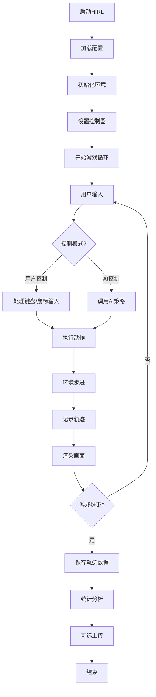

# HIRL - 人机交互强化学习平台

<div align="center">

**Human-in-the-Loop Reinforcement Learning Platform**

一个模块化、可扩展的人机交互强化学习研究平台

[](https://www.python.org/downloads/)
[](https://opensource.org/licenses/MIT)

</div>

## 🌟 项目概览

HIRL是一个专门为人机交互强化学习研究设计的平台，基于PushT环境实现。该平台支持用户通过键盘或鼠标直接控制智能体，收集人类演示数据，并提供完整的轨迹记录、回放和分析功能。

### 核心特性

- **🎮 多模式交互**: 支持键盘和鼠标控制，实时切换用户/AI控制模式
- **📊 轨迹管理**: 完整的轨迹记录、保存、加载和回放功能
- **🤖 RL训练**: 集成PPO和SAC算法，支持从人类演示数据学习
- **📈 数据分析**: 内置数据统计和可视化分析工具
- **☁️ 云端集成**: 支持数据上传到Hugging Face Hub
- **⚙️ 配置驱动**: 基于Hydra的灵活配置管理系统

## 🏗️ 架构设计

### 模块结构

```
HIRL/
├── src/                          # 核心源代码
│   ├── core/                     # 核心模块
│   │   ├── data_types.py         # 数据类型定义
│   │   ├── environment.py        # 环境管理
│   │   └── game.py              # 主游戏逻辑
│   ├── controllers/              # 输入控制器
│   │   ├── keyboard_controller.py
│   │   └── mouse_controller.py
│   ├── data/                     # 数据管理
│   │   ├── data_manager.py       # 数据保存/加载
│   │   └── huggingface_uploader.py
│   ├── visualization/            # 可视化模块
│   │   ├── display.py           # 游戏显示
│   │   └── replay.py            # 轨迹回放
│   └── training/                 # 强化学习训练
│       ├── train_ppo.py         # PPO训练
│       └── train_sac.py         # SAC训练
├── configs/                      # 配置文件
├── analysis/                     # 数据分析工具
├── scripts/                      # 实用脚本
├── demos/                        # 演示文件
├── main.py                       # 主程序入口
└── replay.py                     # 轨迹回放工具
```

### 核心逻辑流程



## 🚀 快速开始

### 环境要求

- Python 3.8+
- CUDA (可选，用于GPU加速训练)

### 安装依赖

```bash
# 克隆仓库
git clone <repository-url>
cd HIRL

# 安装基础依赖
pip install -r requirements.txt

# 安装PushT环境
cd gym-pusht
pip install -e .
cd ..
```

### 基础使用

```bash
# 使用默认配置启动（键盘控制）
python main.py

# 使用命令行参数覆盖配置
python main.py data.num_episodes=10 control.fps=15
```

### 使用不同的配置文件

HIRL提供了多种预设配置文件，可以通过`--config-name`参数指定：

```bash
# 使用默认键盘控制配置
python main.py --config-name=pusht_human

# 使用鼠标控制配置
python main.py --config-name=pusht_human_mouse

# 组合使用：鼠标控制 + 自定义参数
python main.py --config-name=pusht_human_mouse data.num_episodes=5

# 修改特定配置项
python main.py --config-name=pusht_human_mouse \
  control.mouse.smoothing=0.7 \
  control.mouse.click_to_move=true \
  data.save_format=json
```

### 配置文件详解

#### 🎮 键盘控制配置 (`pusht_human.yaml`)
- **控制方式**: WASD键盘控制
- **游戏轮数**: 1轮（测试用）
- **移动速度**: 10像素/步
- **数据保存**: `data/pusht_trajectories/`

```bash
python main.py --config-name=pusht_human
```

#### 🖱️ 鼠标控制配置 (`pusht_human_mouse.yaml`)
- **控制方式**: 鼠标悬停控制
- **游戏轮数**: 2轮
- **平滑系数**: 0.3（较低延迟）
- **数据保存**: `data/pusht_human_mouse_trajectories/`

```bash
python main.py --config-name=pusht_human_mouse
```

### 常用配置组合

```bash
# 快速测试（1轮，键盘控制）
python main.py data.num_episodes=1

# 数据收集模式（10轮，鼠标控制，JSON格式）
python main.py --config-name=pusht_human_mouse \
  data.num_episodes=10 \
  data.save_format=json

# 高质量数据收集（慢速，高精度）
python main.py --config-name=pusht_human_mouse \
  control.fps=5 \
  control.mouse.smoothing=0.8 \
  data.num_episodes=20

# 批量数据生产（快速，多轮）
python main.py data.num_episodes=50 \
  control.fps=15 \
  upload.auto_upload=true \
  upload.repo_id=your-username/pusht-dataset

# 演示模式（鼠标控制，需要点击）
python main.py --config-name=pusht_human_mouse \
  control.mouse.click_to_move=true \
  control.countdown_duration=5
```

### 轨迹回放

```bash
# 使用默认回放配置
python replay.py

# 指定数据文件路径
python replay.py data_path=data/pusht_trajectories/trajectories_5episodes.pkl

# 手动逐步回放
python replay.py manual_play=true

# 回放指定轨迹
python replay.py episode_id=0

# 调整回放参数
python replay.py \
  data_path=your_data_file.pkl \
  delay=0.05 \
  inter_episode_delay=1.0 \
  show_info=true

# 自动连续回放（无间隔）
python replay.py auto_play=true inter_episode_delay=0
```

### 强化学习训练

```bash
# 使用默认PPO配置训练
python src/training/train_ppo.py

# 使用默认SAC配置训练
python src/training/train_sac.py

# 指定配置文件（从configs/rl/目录）
python src/training/train_ppo.py --config-name=ppo
python src/training/train_sac.py --config-name=sac

# 自定义训练参数
python src/training/train_ppo.py \
  training.total_timesteps=1000000 \
  ppo.learning_rate=1e-4 \
  env.n_envs=8 \
  wandb.enabled=true

# 快速训练测试
python src/training/train_ppo.py \
  training.total_timesteps=50000 \
  training.eval_freq=5000 \
  wandb.enabled=false

# 高性能训练（多环境并行）
python src/training/train_ppo.py \
  env.n_envs=16 \
  ppo.n_steps=4096 \
  ppo.batch_size=128 \
  training.total_timesteps=2000000
```

## 🎮 控制说明

### 键盘控制
- **WASD**: 控制智能体移动
- **空格键**: 切换用户/AI控制模式
- **R**: 重置环境
- **Q**: 退出游戏

### 鼠标控制
- **鼠标移动**: 设置智能体目标位置
- **左键拖拽** (可选): 需要按住左键才移动
- **空格键**: 切换控制模式
- **Q**: 退出游戏

## 📊 数据格式

### 轨迹数据结构

```python
@dataclass
class TrajectoryStep:
    observation: Any          # 环境观测
    action: np.ndarray       # 执行的动作
    reward: float            # 获得的奖励
    terminated: bool         # 是否正常结束
    truncated: bool          # 是否超时结束
    info: Dict[str, Any]     # 环境信息
    is_human_action: bool    # 是否为人类动作

@dataclass
class Episode:
    steps: List[TrajectoryStep]  # 轨迹步骤列表
    episode_id: int             # 轨迹ID
    total_reward: float         # 总奖励
    success: bool               # 是否成功
    length: int                 # 轨迹长度
    initial_state: Dict         # 初始状态信息
```

### 支持的保存格式

- **HDF5** (.h5): 推荐格式，高效压缩，纯数据，无类依赖
- **JSON** (.json): 人类可读，跨平台兼容，纯数据格式  
- **CSV** (.csv): 最通用格式，适合数据分析，无类依赖
- **NPZ** (.npz): NumPy压缩格式，适合数值数据，纯数据
- **Pickle** (.pkl): 不推荐，包含类引用，有依赖问题

**重要提示**: 新的数据格式（HDF5/JSON/CSV/NPZ）都是纯数据格式，不包含对Python类的引用，便于长期存储和跨环境使用。详见 [数据格式指南](docs/DATA_FORMATS.md)。

## 🔧 配置系统

HIRL使用Hydra进行配置管理，支持命令行参数覆盖和配置文件组合。

### 可用配置文件

| 配置文件 | 用途 | 主要特点 |
|---------|------|----------|
| `pusht_human.yaml` | 默认键盘控制 | WASD控制，1轮游戏，测试用 |
| `pusht_human_mouse.yaml` | 鼠标控制 | 鼠标悬停控制，2轮游戏 |
| `replay.yaml` | 轨迹回放 | 用于replay.py的回放配置 |
| `rl/ppo.yaml` | PPO训练 | 强化学习PPO算法配置 |
| `rl/sac.yaml` | SAC训练 | 强化学习SAC算法配置 |

### 配置覆盖语法

```bash
# 基本语法
python main.py key=value

# 嵌套配置
python main.py parent.child=value

# 多个参数
python main.py key1=value1 key2=value2

# 指定配置文件
python main.py --config-name=config_name

# 配置文件 + 参数覆盖
python main.py --config-name=config_name key=value
```

### 主要配置类别

#### 环境配置 (`env`)
```yaml
env:
  obs_type: "pixels_agent_pos"    # 观测类型
  max_episode_steps: 300          # 最大步数
  success_threshold: 0.95         # 成功阈值
```

#### 控制配置 (`control`)
```yaml
control:
  input_mode: "keyboard"          # 输入模式: keyboard/mouse
  user_control: true              # 初始控制模式
  fps: 10                        # 渲染帧率
  keyboard_move_speed: 10         # 键盘移动速度
```

#### 数据配置 (`data`)
```yaml
data:
  num_episodes: 5                 # 游戏轮数
  save_dir: "data/pusht_trajectories"
  save_format: "pickle"           # 保存格式
  dataset_name: "pusht_human_demo"
```

#### 上传配置 (`upload`)
```yaml
upload:
  hf_token: null                  # Hugging Face token
  repo_id: "pusht-human-demo"     # 仓库ID
  auto_upload: false              # 自动上传
  private: false                  # 私有仓库
```

## 🤖 强化学习训练

### PPO训练

```bash
# 基础训练
python src/training/train_ppo.py

# 自定义参数
python src/training/train_ppo.py \
  training.total_timesteps=1000000 \
  ppo.learning_rate=3e-4 \
  env.n_envs=8 \
  wandb.enabled=true
```

### SAC训练

```bash
# 基础训练
python src/training/train_sac.py

# 自定义参数
python src/training/train_sac.py \
  training.total_timesteps=1000000 \
  sac.learning_rate=3e-4 \
  sac.buffer_size=200000
```

### 训练配置

主要训练参数：
- `training.total_timesteps`: 总训练步数
- `training.eval_freq`: 评估频率
- `env.n_envs`: 并行环境数量
- `wandb.enabled`: 是否启用WandB日志

## 📈 数据分析

### 内置分析工具

```bash
# 查看analysis目录下的分析脚本
ls analysis/

# 运行数据分析
python analysis/analyze_human_vs_ai_actions.py
```

### 可视化分析

平台提供多种可视化分析功能：
- 轨迹统计分析
- 人类vs AI动作对比
- 成功率趋势分析
- 像素观测可视化

## 🔗 扩展开发

### 添加新的控制器

1. 在 `src/controllers/` 下创建新的控制器类
2. 继承基础控制器接口
3. 在主游戏逻辑中注册新控制器

### 添加新的环境

1. 在 `src/core/environment.py` 中扩展环境管理器
2. 添加环境特定的配置选项
3. 更新数据类型以支持新的观测格式

### 添加新的训练算法

1. 在 `src/training/` 下创建新的训练脚本
2. 使用统一的配置系统
3. 集成WandB日志记录

## 🤝 贡献指南

我们欢迎社区贡献！请遵循以下步骤：

1. Fork本仓库
2. 创建特性分支 (`git checkout -b feature/amazing-feature`)
3. 提交更改 (`git commit -m 'Add amazing feature'`)
4. 推送分支 (`git push origin feature/amazing-feature`)
5. 开启Pull Request

### 开发规范

- 遵循PEP 8代码风格
- 添加完整的文档字符串
- 为新功能编写测试
- 更新相关文档

## 📄 许可证

本项目采用MIT许可证 - 查看 [LICENSE](LICENSE) 文件了解详情。

## 🙏 致谢

- [PushT环境](https://github.com/columbia-ai-robotics/diffusion_policy) 提供了优秀的机器人操作基准
- [Stable Baselines3](https://github.com/DLR-RM/stable-baselines3) 提供了强化学习算法实现
- [Hydra](https://hydra.cc/) 提供了灵活的配置管理系统
- [WandB](https://wandb.ai/) 提供了实验跟踪和可视化功能

## 📞 联系我们

如有问题或建议，请通过以下方式联系：

- 开启GitHub Issue
- 发送邮件至 hirl@example.com
- 加入我们的讨论群

---

<div align="center">
Made with ❤️ by HIRL Team
</div> 